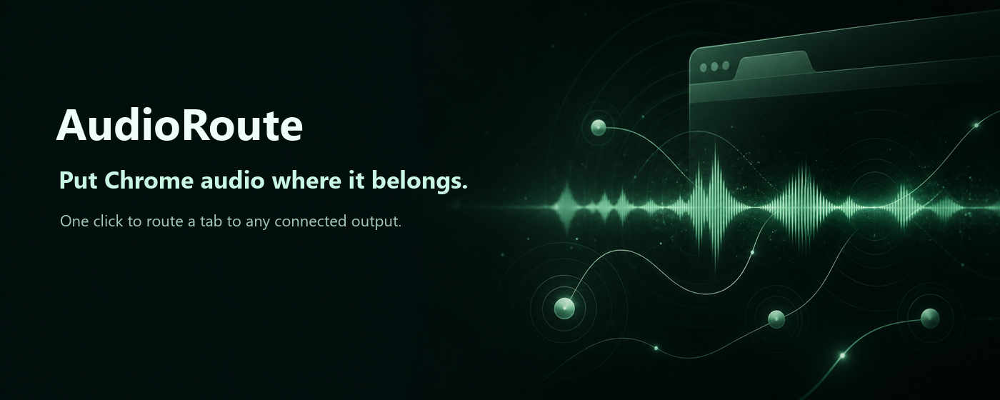
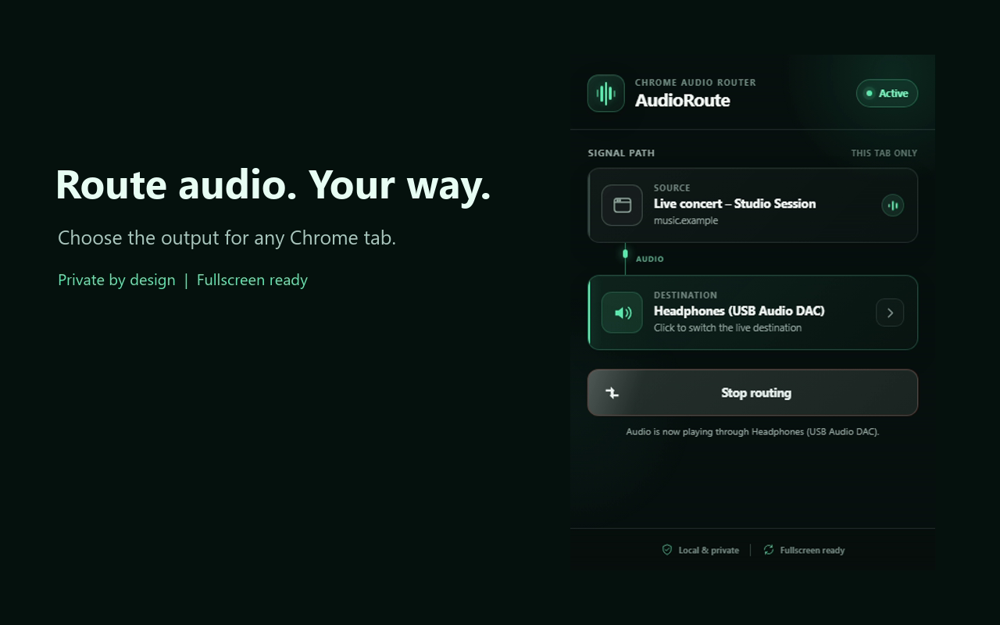

<div align="center">



# AudioRoute

### One Chrome tab. Any audio output. No system-wide switching.

Route a tab to headphones, speakers, HDMI, a USB DAC, or a virtual device — while every other app keeps using the Windows default output.

<p>
  
  
  
  
</p>

<p>
  <a href="#install-locally"><strong>Install locally</strong></a>
  ·
  <a href="#how-it-works"><strong>How it works</strong></a>
  ·
  <a href="#privacy-by-design"><strong>Privacy</strong></a>
  ·
  <a href="#development"><strong>Development</strong></a>
</p>

</div>

---

## Your browser has more than one destination

Windows lets applications choose an audio output. Chrome usually sends every tab to the same one. AudioRoute adds the missing layer: **output selection per active tab**.

<table>
  <tr>
    <td width="33%" valign="top">
      <strong>🎯 Per-tab control</strong><br><br>
      Redirect only the tab you choose. The rest of Chrome and Windows stay untouched.
    </td>
    <td width="33%" valign="top">
      <strong>⚡ Guided routing</strong><br><br>
      Pick a device. If Chrome needs permission, approve it in the focused setup window; otherwise selection stays inline.
    </td>
    <td width="33%" valign="top">
      <strong>🔒 Local by default</strong><br><br>
      No account, backend, analytics, recording, upload, or browsing-history access.
    </td>
  </tr>
  <tr>
    <td width="33%" valign="top">
      <strong>🎧 Two devices at once</strong><br><br>
      Play one tab through headphones <em>and</em> speakers, each with its own volume and a delay to line them up.
    </td>
    <td width="33%" valign="top">
      <strong>🪟 Popup-free playback</strong><br><br>
      Close the popup whenever you want. The route continues in the background.
    </td>
    <td width="33%" valign="top">
      <strong>⛶ Fullscreen aware</strong><br><br>
      A small compatibility bridge helps common video players enter native fullscreen.
    </td>
  </tr>
</table>

## See the route at a glance



The signal-path interface keeps the important state visible: **source tab → selected destination → live routing status**. Changing the destination is always one click away.

## Start routing in seconds

1. Play audio in a Chrome tab.
2. Open **AudioRoute** from the toolbar.
3. Select an output device. If Chrome asks for permission, finish the focused setup window, return to the source tab, reopen **AudioRoute**, and choose **Start routing**. With existing permission, routing starts from the inline picker.
4. Playback survives closing the popup.

To switch outputs, click the current destination. To restore normal playback, reopen AudioRoute on the routed tab and choose **Stop routing**.

> [!TIP]
> AudioRoute never changes the Windows default output. Your games, calls, music apps, and other Chrome tabs keep their existing destination.

## How it works


When you invoke AudioRoute, its service worker obtains an audio stream ID for the active tab. A hidden extension document consumes that stream, creates a Web Audio context, and selects your requested output with `AudioContext.setSinkId()`. Everything stays inside Chrome's local media pipeline.

## Install locally

AudioRoute runs directly from the repository—no compilation step is required.

1. Download or clone this repository.
2. Open `chrome://extensions` in desktop Chrome.
3. Enable **Developer mode**.
4. Select **Load unpacked**.
5. Choose the repository folder containing `manifest.json`.
6. Pin **AudioRoute** from Chrome's Extensions menu.

**Requirement:** Google Chrome 116 or newer on desktop.

## A note about device access

Chrome does not expose the complete list of audio outputs in every context until media-device access has been granted. When permission is still pending or blocked, AudioRoute opens device setup in its own focused window, outside the toolbar popup, so Chrome's permission prompt remains fully visible and clickable. Once access is available, the normal output picker stays inside the toolbar popup. If the native speaker picker is unavailable, AudioRoute requests one-time media permission only to reveal the available output-device names.

The temporary microphone stream is stopped immediately. It is **never recorded, monitored, played, stored, uploaded, or transmitted**.

## Fullscreen compatibility

Chromium may reject a page-level `requestFullscreen()` while that same tab is being captured, even though browser-level <kbd>F11</kbd> still works. AudioRoute handles this by injecting a small bundled bridge only into the user-invoked tab. It recognizes common fullscreen controls, briefly suspends capture before the transition, and restores the same route afterward.

Built-in support covers common YouTube-style controls, Video.js, Shaka Player, Plyr, and accessible fullscreen buttons identified through labels or titles. Unusual embedded players can still require <kbd>F11</kbd>.

## Night mode and voice clarity

Two optional switches per tab, both off by default:

- **Night mode** evens out loud and quiet passages so late-night dialogue stays audible without
  the next explosion waking the house. It costs a fixed **6 ms of latency** while active — far
  below the threshold where lip sync becomes noticeable, but not free, which is why the popup
  says so and why the compressor is removed from the graph rather than flattened when you turn
  it off. Measured on Chromium: with night mode off the chain is bit-identical to a direct
  connection.
- **Voice clarity** lifts speech around 2 kHz by 6 dB. It adds no latency.

## Privacy by design

> [!IMPORTANT]
> AudioRoute has no backend and makes no network requests. Audio never leaves your device.

- No account or sign-in
- No analytics or telemetry
- No advertising or tracking
- No cloud processing
- No audio recording or transcript
- No browsing-history permission
- No broad host permissions such as `<all_urls>`
- No remote code

Persistent preferences are the locally selected output-device identifier and label, plus the processing switches (mono, balance, night mode, voice clarity). Per-tab volume is deliberately **not** persisted: every route starts at 100% so a boost left over from a quiet tab cannot surprise you on the next one.

While a route is running, AudioRoute keeps the routed tab's title and host in memory so the popup can list routes on other tabs — Chrome does not hand that back without the `tabs` permission, which AudioRoute does not request. The host is stored instead of the full URL, both values live only for the lifetime of the route, and neither is ever written to storage.

Temporary session storage is used solely to resume device selection after Chrome's permission flow.

## Permissions, without the mystery

| Permission | Why AudioRoute needs it |
| :--- | :--- |
| `activeTab` | Temporarily identifies the tab from which the user opened AudioRoute. |
| `tabCapture` | Creates the selected tab's local audio stream after an explicit user action. |
| `offscreen` | Keeps the Web Audio context alive after the extension popup closes. |
| `scripting` | Injects the bundled fullscreen compatibility bridge into that active tab. |
| `storage` | Remembers the selected local output and resumes interrupted device setup. |

Every permission directly supports the extension's single purpose. There is no persistent access to websites.

## Technical boundaries

- Routing is per tab, and a tab can play on two devices at once. AudioRoute stops at six
  concurrent outputs, because every output needs its own audio context — three tabs on two
  devices each is the ceiling.
- Two devices rarely run in step. The per-output delay lines them up; without it the same
  audio on speakers and headphones sounds like a comb filter.
- Chrome system pages, the Chrome Web Store, and other protected pages cannot be captured.
- Chrome shows its normal tab-capture indicator while routing is active.
- Bluetooth, HDMI, and virtual devices can add latency at the operating-system or driver level.
- Disconnecting the active device stops the route safely instead of leaving the tab silently captured.
- AudioRoute requires `AudioContext.setSinkId()` and therefore a current desktop version of Chrome.

## Development

Run the complete non-audio verification suite:

```powershell
npm run verify
```

This validates the Manifest V3 package, required assets, JavaScript syntax, popup structure, and utility tests. It neither opens an audio route nor plays a test sound.

Build the publishable Chrome Web Store package:

```powershell
npm run build:release
```

The build verifies the project, increments the patch version in `manifest.json` and `package.json`, and writes `release/AudioRoute-v<version>.zip` with `manifest.json` at the archive root. Tests, development scripts, screenshots, and other non-runtime files are excluded automatically. A SHA-256 checksum is printed after every successful build.

<details>
<summary><strong>Project structure</strong></summary>

```text
AudioRoute/
├── manifest.json          Extension metadata and permissions
├── service-worker.js      Capture lifecycle and routing coordination
├── popup/                 Compact signal-path and route controls
├── setup/                 Visible permission and output-selection flow
├── offscreen/             Persistent AudioContext and sink selection
├── content/               Temporary fullscreen compatibility bridge
├── shared/                Messages, errors, and device helpers
├── icons/                 Extension icons for Chrome
├── tests/                 Node-based utility tests
├── scripts/               Validation, inspection, and release tooling
└── docs/assets/           GitHub README visuals
```

</details>

<details>
<summary><strong>Regenerate extension icons</strong></summary>

```powershell
powershell -ExecutionPolicy Bypass -File .\scripts\generate-icons.ps1
```

</details>

## Built for a simple promise

> **The right tab. The right output. Nothing leaves your machine.**

AudioRoute focuses on doing one thing well: giving a Chrome tab its own audio destination without turning a small routing task into a system-wide configuration exercise.

## License

This repository currently has no license file. Unless a license is added, standard copyright rules apply.
